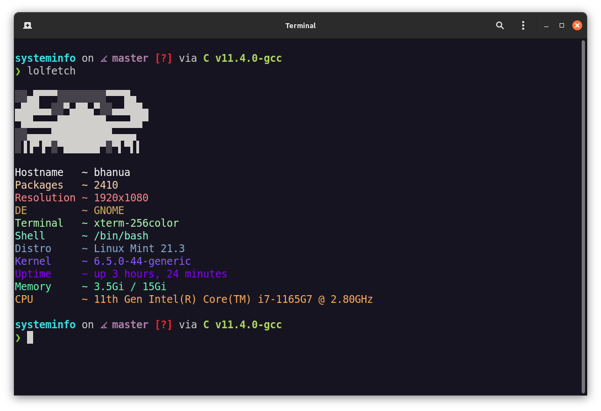

# lolfetch

**lolfetch** a simple system fetch tool rawdogged in C.

## Features



## Installation

```bash
git clone https://github.com/vajradevam/lolfetch
```

```bash
make
```

```bash
mv lolfetch /usr/bin
```

## License

This project is licensed under the GNU GPL-V3 - see the [License](LICENSE) file for details.

Made with ❤️ by Vajra
